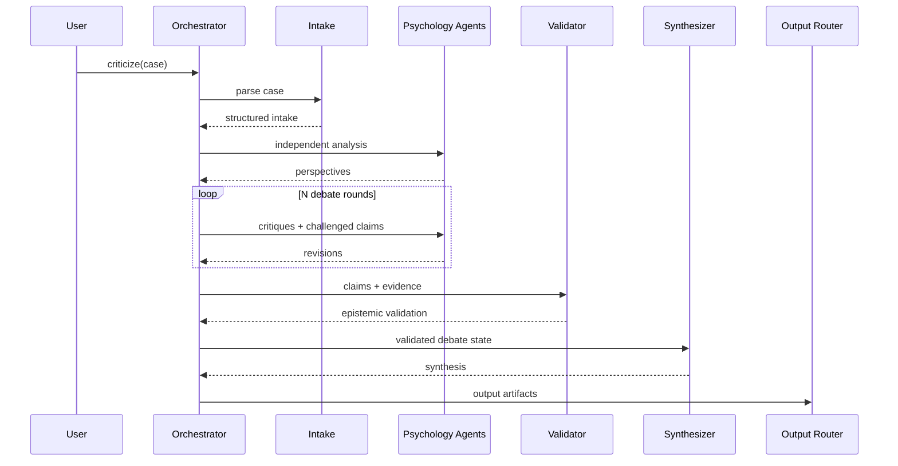

# CODEX MASTER BUILD PROMPT
## Psychology Multi-Agent Debate Laboratory

You are **Codex acting as the implementation owner, senior software architect, Python engineer, AI-agent workflow designer, and test engineer for this repository**.

Your job is not to only propose an architecture or produce example code.

Your job is to:

1. inspect the current repository;
2. understand what already exists;
3. design the missing architecture;
4. implement the project;
5. create configuration, prompts, tests, examples, and documentation;
6. run the project and automated tests;
7. inspect failures;
8. fix issues;
9. leave the repository in a runnable, understandable, extensible state.

Do not stop after producing a plan.

Do not wait for approval between implementation phases unless execution is genuinely blocked by missing external credentials or unavailable dependencies.

When API credentials are unavailable, implement everything possible, mock external calls in tests, and clearly document the command the user should run after adding credentials.

---

# 1. PROJECT

Project name:

`psychology-multi-agent-lab`

The project is an **educational multi-agent psychology case-analysis laboratory**.

A learner places a fictional or anonymized psychology case into:

```text
input/
```

Then runs a command such as:

```bash
python -m app criticize \
  --case social-withdrawal.md \
  --mode both \
  --rounds 3
```

The system must:

```text
Case
→ Intake
→ Independent analyses from multiple psychology lenses
→ Multi-round structured debate
→ Cross-critique
→ Claim revision
→ Epistemic validation
→ Synthesis
→ Output routing
→ Logs + educational artifacts
```

The primary purpose is to help learners practice:

- comparative psychological analysis;
- theoretical reasoning;
- hypothesis generation;
- causal reasoning;
- criticism;
- epistemic validation;
- synthesis.

This system is **NOT a clinical diagnosis tool**.

---

# 2. CRITICAL ARCHITECTURAL DISTINCTION

Do not confuse two different layers.

## Development layer

Codex is the software engineering agent building the project.

## Runtime layer

The application contains runtime AI agents such as:

- Psychoanalytic lens
- Behaviorist lens
- Humanistic lens
- Cognitive/CBT lens
- Attachment lens
- Existential lens

Codex itself is NOT one of the psychology agents.

---

# 3. DESIGN PRINCIPLES

Prioritize:

```text
explicit state
> implicit conversation history

structured debate
> personality roleplay

epistemic clarity
> persuasive prose

deterministic orchestration
> uncontrolled agent handoffs

testability
> unnecessary complexity

learning value
> simulated intellectual theater

safety
> completeness
```

Do not build a system where eight agents simply generate eight essays.

The intellectual core of the system must be:

```text
claim
→ critique
→ evidence comparison
→ defend / revise / partially revise / withdraw
→ validation
→ synthesis
```

---

# 4. RECOMMENDED TECHNOLOGY

Use Python.

Prefer a modern supported Python version.

For runtime LLM integration:

- default provider: OpenAI;
- credentials from environment variables;
- never hardcode API keys.

Environment:

```text
OPENAI_API_KEY=
```

Prefer using the official OpenAI Python ecosystem.

You may use the OpenAI Agents SDK if it improves:

- agent definitions;
- structured outputs;
- tracing;
- tool abstraction;
- guardrails.

However:

**Do not let Agents SDK abstractions replace explicit application state.**

The debate loop, round number, claim registry, participant set, routing, and output state should remain controlled by Python orchestration code.

Prefer:

```text
Python code-driven orchestrator
        ↓
specialized agents
        ↓
structured results
        ↓
DebateState
```

over uncontrolled peer-to-peer handoffs.

Create an LLM/provider abstraction so core business logic is not tightly coupled to one model implementation.

Example:

```python
class LLMProvider(Protocol):
    async def generate(...):
        ...
```

Default implementation:

```text
OpenAIProvider
```

---

# 5. USER WORKFLOW

The basic learner workflow must be:

```text
1. Create case file
2. Put case in input/
3. Run criticize command
4. Select analyse / consulting / both
5. Configure number of debate rounds
6. Inspect debate log
7. Inspect final educational artifacts
```

Example:

```bash
python -m app criticize \
  --case case-01.md \
  --mode analyse
```

```bash
python -m app criticize \
  --case case-01.md \
  --mode consulting \
  --rounds 5
```

```bash
python -m app criticize \
  --case case-01.md \
  --mode both \
  --rounds 3
```

If `--rounds` is omitted, use the configuration default.

---

# 6. INPUT

Support at minimum:

```text
.md
.txt
.json
```

Input directory:

```text
input/
```

Do not silently invent facts missing from the case.

The system must explicitly distinguish:

```text
information provided by case
vs
agent inference
```

---

# 7. DEFAULT PSYCHOLOGY PANEL

Create configurable psychology agents.

Agents should be described as:

> theoretical lenses inspired by the published work associated with a psychologist or psychological school.

Do NOT claim that an AI agent literally reproduces what the historical person would say.

Default panel:

## Freud-inspired psychoanalytic lens

Focus:

- unconscious conflict;
- defense mechanisms;
- internal conflict;
- developmental interpretation.

Rules:

- speculative unconscious explanations must be labeled;
- missing childhood data must not be invented.

---

## Jung-inspired analytical psychology lens

Focus:

- complexes;
- persona;
- shadow;
- symbolic interpretation;
- individuation.

Rules:

- symbolism is interpretation, not observed fact.

---

## Skinner-inspired behaviorist lens

Focus:

- observable behavior;
- antecedents;
- reinforcement;
- punishment;
- environmental contingencies.

Rules:

- prioritize observable evidence;
- avoid unnecessary hidden-state inference.

---

## Rogers-inspired humanistic/person-centered lens

Focus:

- self-concept;
- congruence;
- conditions of worth;
- autonomy;
- subjective lived experience.

Rules:

- empathic interpretation must remain distinct from fact;
- do not turn analysis into therapy.

---

## Beck-inspired cognitive/CBT lens

Focus:

- situation;
- automatic thoughts;
- beliefs;
- emotion;
- behavior;
- cognitive interpretation.

Rules:

- cognitive distortions require case evidence;
- do not diagnose disorders.

---

## Bowlby-inspired attachment lens

Focus:

- relational patterns;
- internal working model hypotheses;
- proximity/separation behavior.

Rules:

- never assert attachment style with certainty from limited evidence.

---

## Frankl-inspired existential/logotherapy lens

Focus:

- meaning;
- values;
- responsibility;
- existential tension;
- relationship to suffering.

Rules:

- avoid moralizing;
- avoid implying suffering is simply a choice.

---

## Ellis-inspired REBT lens

Focus:

- activating event;
- belief;
- emotional/behavioral consequence;
- rigid demands;
- absolutistic thinking.

Rules:

- do not casually label a person irrational;
- keep language educational and respectful.

---

# 8. AGENT CONFIGURATION

Create:

```text
config/agents.yaml
```

Example:

```yaml
agents:
  freud:
    enabled: true

  jung:
    enabled: true

  skinner:
    enabled: true

  rogers:
    enabled: true

  beck:
    enabled: true

  bowlby:
    enabled: true

  frankl:
    enabled: true

  ellis:
    enabled: true
```

Adding or disabling an agent should not require changes to the main orchestration code.

Prefer registry/factory-based loading.

---

# 9. SYSTEM AGENTS

Psychology agents participate in theoretical analysis.

Also create non-persona system agents.

## Intake Agent

Responsibilities:

- parse case;
- summarize without adding information;
- extract observable facts;
- identify reported experiences;
- identify contextual factors;
- identify timeline;
- identify ambiguities;
- identify missing information;
- identify possible safety flags.

Structured output concept:

```json
{
  "case_name": "",
  "case_summary": "",
  "observable_facts": [],
  "reported_experiences": [],
  "behaviors": [],
  "relationships": [],
  "contextual_factors": [],
  "timeline": [],
  "missing_information": [],
  "ambiguities": [],
  "risk_flags": []
}
```

---

## Epistemic Validator

The validator must inspect major claims produced during debate.

Every major claim should be classifiable as:

```text
FACT
INTERPRETATION
ASSUMPTION
HYPOTHESIS
RECOMMENDATION
```

For each important claim record:

```text
claim
agent
epistemic type
case evidence
missing evidence
confidence
overreach risk
contradictions
notes
```

Confidence:

```text
high
medium
low
```

The validator must not choose a claim because it sounds eloquent.

---

## Synthesizer

The synthesizer has no psychology-school allegiance.

Responsibilities:

- identify consensus;
- identify disagreements;
- identify complementary perspectives;
- identify unsupported claims;
- identify unresolved hypotheses;
- identify information needed to distinguish hypotheses;
- preserve meaningful disagreements instead of flattening them.

---

# 10. ORCHESTRATION

Use explicit Python orchestration.

Core flow:

```text
load config
↓
load case
↓
create run
↓
intake
↓
independent psychology analyses
↓
freeze independent results
↓
debate round 1
↓
update claim registry
↓
debate round 2
↓
...
↓
debate round N
↓
epistemic validation
↓
synthesis
↓
output generation
↓
save logs
```

Independent analyses may run concurrently.

A debate round must be logically frozen:

Agents in round `N` may use information available up to round `N`.

Do not allow accidental future-state leakage.

---

# 11. DEBATE PROTOCOL

Avoid open-ended chat.

## Phase 1 — Independent Analysis

Every psychology agent independently receives:

```text
original case
+
structured intake
```

They must NOT see other psychology-agent outputs yet.

Required structured sections:

```text
Lens
Case observations used
Primary interpretation
Possible causal mechanisms
Alternative hypotheses
Missing information
What this framework explains well
What this framework may explain poorly
Epistemic labels
Confidence
```

---

## Phase 2 — Cross-Critique

Once all independent analyses are collected, create critiques.

Each agent should:

1. identify up to three important claims from other agents;
2. state agreement where appropriate;
3. identify assumptions;
4. identify unsupported inference;
5. explain theoretical disagreement;
6. reference case evidence;
7. provide counter-hypothesis where useful.

Do not optimize for adversarial rhetoric.

Optimize for educational comparison.

---

## Phase 3 — Revision

For challenged claims, each originating agent must be able to choose:

```text
DEFEND
REVISE
PARTIALLY_REVISE
WITHDRAW_CLAIM
```

Each decision stores only:

- claim;
- evidence;
- concise rationale;
- counterargument considered;
- revision decision.

Do NOT request, expose, or save hidden chain-of-thought.

Store concise, user-auditable rationales instead.

---

## Phase 4 — Repeat

Repeat critique/revision for configured number of rounds.

Configuration controls:

```text
debate.rounds
```

CLI `--rounds` overrides configuration.

Exactly N rounds must occur when N is requested.

---

# 12. DEBATE STATE

Create a serializable state object.

Conceptually:

```python
class DebateState:
    run_id
    case
    intake
    enabled_agents
    round_number
    analyses
    critiques
    claim_registry
    unresolved_questions
    validation_results
    synthesis
```

Use dataclasses or Pydantic if appropriate.

State should be serializable to JSON.

Save checkpoint state after important stages.

---

# 13. CLAIM REGISTRY

This is a required component.

Example claim:

```json
{
  "claim_id": "CLM-001",
  "agent": "beck",
  "round_created": 0,
  "claim": "The behavior may be maintained by...",
  "epistemic_type": "hypothesis",
  "supporting_case_evidence": [],
  "challenged_by": [],
  "status": "active",
  "confidence": "medium"
}
```

Statuses:

```text
active
challenged
revised
withdrawn
disputed
converged
```

Track claim evolution over debate rounds.

Final output must allow learners to see:

```text
initial claim
→ challenges
→ agent response
→ final claim state
```

---

# 14. APPLICATION CONFIG

Create:

```text
config/settings.yaml
```

Example:

```yaml
llm:
  provider: openai
  model: REPLACE_WITH_SUPPORTED_MODEL
  temperature: 0.3
  max_output_tokens: 4000

debate:
  rounds: 3
  max_agents: 8
  parallel_independent_analysis: true
  cross_critique_strategy: round_robin
  allow_agent_revision: true

output:
  mode: both
  include_raw_agent_outputs: true
  include_epistemic_map: true
  include_debate_transcript: true
  include_final_summary: true

safety:
  educational_only: true
  prohibit_clinical_diagnosis: true
  prohibit_medication_advice: true
  flag_crisis_content: true

logging:
  save_markdown: true
  save_json_trace: true

runtime:
  retries: 2
```

Validate configuration on startup.

Invalid values must produce readable errors.

---

# 15. MODES

Support:

```text
analyse
consulting
both
```

## Analyse

Educational theoretical analysis.

Focus on:

- case framing;
- observations;
- theoretical perspectives;
- competing hypotheses;
- causal interpretation;
- disagreements;
- epistemic map;
- evidence gaps.

Do not create a treatment plan.

Save to:

```text
analyse/
```

---

## Consulting

This means **educational consultation for the learner**, not clinical consultation for the person in the case.

Focus on:

- questions the learner should ask;
- missing data;
- competing interpretations;
- what evidence would discriminate hypotheses;
- blind spots;
- useful theoretical lenses;
- further study exercises;
- when professional assessment could be appropriate.

Save to:

```text
consulting/
```

---

## Both

Generate both artifacts.

Do not merely duplicate the same document into both folders.

---

# 16. OUTPUT FILENAMES

Use machine local time.

Filename:

```text
criticize-log-YYYY-MM-DD-HH-mm-ss-case-name.md
```

Example:

```text
criticize-log-2026-08-28-17-30-05-social-withdrawal.md
```

Folders:

```text
analyse/
consulting/
logs/
checkpoints/
```

JSON trace:

```text
logs/criticize-log-YYYY-MM-DD-HH-mm-ss-case-name.json
```

Use safe slugification.

---

# 17. RAW DEBATE LOG

Markdown log should include at minimum:

```markdown
# Psychology Multi-Agent Critique

## Run Metadata

## Original Case

## Structured Intake

## Missing Information

# Independent Analyses

## Freud-inspired Lens
...

## Skinner-inspired Lens
...

# Debate Round 1

## Critiques

## Revisions

# Debate Round 2
...

# Claim Evolution

# Epistemic Validation

# Consensus

# Major Disagreements

# Missing Evidence

# Unresolved Hypotheses

# Final Synthesis

# Reflection Questions

# Educational Safety Note
```

---

# 18. ANALYSE OUTPUT CONTRACT

Generate a learner-friendly analysis document.

Recommended structure:

```markdown
# Case Analysis — [case]

## 1. Case Framing

## 2. Facts Available

## 3. Missing Information

## 4. Perspectives by Psychological School

## 5. Comparative Matrix

| Lens | Primary Focus | Main Explanation | Evidence Used | Key Assumption | Limitation |
|---|---|---|---|---|---|

## 6. Competing Hypotheses

## 7. Causal Interpretations

## 8. Areas of Agreement

## 9. Areas of Disagreement

## 10. Claim Evolution

## 11. Epistemic Map

## 12. What Cannot Be Concluded

## 13. Questions for Further Study

## 14. Learning Takeaways
```

---

# 19. CONSULTING OUTPUT CONTRACT

Generate:

```markdown
# Educational Consultation — [case]

## 1. Important Areas to Explore

## 2. Questions to Ask Before Drawing Conclusions

## 3. Alternative Interpretations Worth Testing

## 4. What Each Psychological Lens Suggests Examining

## 5. Potential Blind Spots

## 6. Evidence Needed to Distinguish Hypotheses

## 7. Suggested Learning Exercises

## 8. When Professional Assessment May Be Appropriate

## 9. Limits of This Analysis
```

Do not create headings such as:

```text
Diagnosis
Treatment Plan
Medication
Prescription
```

---

# 20. SAFETY

Enforce safety in both prompts and code-level workflow.

This is an educational system.

It must not present itself as a clinician.

Rules:

1. Do not diagnose psychiatric or psychological disorders from a case description.

2. Do not prescribe medication.

3. Do not provide personalized treatment instructions as if conducting therapy.

4. Do not state speculative psychological constructs as facts.

5. Do not infer as fact without evidence:

```text
childhood trauma
abuse
attachment style
personality disorder
unconscious motive
mental disorder
```

6. Statements like:

```text
"This person has disorder X."
```

must be avoided unless merely quoting input for analysis.

Prefer language such as:

```text
"The description may overlap with phenomena studied in X, but the available information is insufficient for diagnosis."
```

7. If the case includes:

```text
self-harm
suicidal intent
violence
immediate danger
```

the system must:

- flag safety risk;
- avoid treating it only as an academic debate;
- clearly state that immediate safety concerns require qualified human support;
- avoid pretending the AI debate is adequate professional assessment.

8. The system must identify when historical theories rely on contested or weak assumptions.

---

# 21. PROMPT FILES

Do not hardcode long prompts inside application code.

Create approximately:

```text
prompts/
├── shared/
│   ├── safety.md
│   ├── epistemic_rules.md
│   └── output_rules.md
│
├── system/
│   ├── intake.md
│   ├── validator.md
│   └── synthesizer.md
│
├── psychology/
│   ├── freud.md
│   ├── jung.md
│   ├── skinner.md
│   ├── rogers.md
│   ├── beck.md
│   ├── bowlby.md
│   ├── frankl.md
│   └── ellis.md
│
└── debate/
    ├── independent_analysis.md
    ├── critique_round.md
    └── revision_round.md
```

Compose prompts from:

```text
shared rules
+
agent lens
+
phase instructions
+
structured context
```

---

# 22. RECOMMENDED PROJECT STRUCTURE

Use this as a starting point, but improve it if there is a clear reason:

```text
psychology-multi-agent-lab/
├── README.md
├── pyproject.toml
├── .env.example
├── .gitignore
│
├── config/
│   ├── settings.yaml
│   └── agents.yaml
│
├── input/
│   └── .gitkeep
│
├── analyse/
│   └── .gitkeep
│
├── consulting/
│   └── .gitkeep
│
├── logs/
│   └── .gitkeep
│
├── checkpoints/
│   └── .gitkeep
│
├── examples/
│   └── case-work-withdrawal.md
│
├── prompts/
│   ├── shared/
│   ├── system/
│   ├── psychology/
│   └── debate/
│
├── app/
│   ├── __init__.py
│   ├── __main__.py
│   ├── cli.py
│   ├── config.py
│   ├── models.py
│   ├── state.py
│   │
│   ├── providers/
│   │   ├── base.py
│   │   └── openai_provider.py
│   │
│   ├── agents/
│   │   ├── base.py
│   │   ├── psychology.py
│   │   ├── intake.py
│   │   ├── validator.py
│   │   └── synthesizer.py
│   │
│   ├── orchestration/
│   │   ├── runner.py
│   │   ├── debate.py
│   │   ├── claim_registry.py
│   │   └── router.py
│   │
│   ├── outputs/
│   │   ├── markdown.py
│   │   ├── json_trace.py
│   │   └── filenames.py
│   │
│   └── utils/
│       ├── prompts.py
│       ├── slug.py
│       └── time.py
│
└── tests/
    ├── test_config.py
    ├── test_input.py
    ├── test_rounds.py
    ├── test_agent_registry.py
    ├── test_claim_registry.py
    ├── test_routing.py
    ├── test_filename.py
    ├── test_safety.py
    └── test_end_to_end_mocked.py
```

Maintain clear separation of concerns.

---

# 23. OBSERVABILITY

Generate `run_id` for every run.

Machine-readable events should include useful events such as:

```text
RUN_STARTED
CASE_PARSED
INTAKE_COMPLETED
AGENT_STARTED
AGENT_COMPLETED
ROUND_STARTED
CLAIM_CREATED
CLAIM_CHALLENGED
CLAIM_REVISED
CLAIM_WITHDRAWN
VALIDATION_STARTED
VALIDATION_COMPLETED
SYNTHESIS_COMPLETED
OUTPUT_WRITTEN
RUN_COMPLETED
RUN_FAILED
```

Do not log secrets.

---

# 24. FAILURE HANDLING

If one psychology agent fails:

- retry according to config;
- record error;
- continue if enough participants remain;
- final synthesis must disclose missing participant output.

If the entire LLM provider fails:

- save checkpoint where possible;
- exit non-zero;
- display useful error.

If practical, implement:

```bash
python -m app resume --run-id RUN_ID
```

Resume is desirable but secondary to a correct MVP.

---

# 25. EDUCATIONAL FEATURES

The final output must help a learner compare theoretical thinking.

Add:

## School comparison

For each lens:

```text
what it notices
what it explains
what assumptions it uses
what evidence it emphasizes
what it may overlook
```

## Reflection questions

Generate questions similar to:

```text
1. Which lens relied most heavily on directly observable case evidence?
2. Which lens relied most heavily on inference?
3. Was the largest disagreement about evidence or theory?
4. What additional evidence would most change the debate?
5. Which two lenses appear complementary?
6. Which claim changed most during the debate?
```

## Epistemic exercise

Select several claims and allow the learner to inspect whether they are:

```text
fact
interpretation
assumption
hypothesis
recommendation
```

---

# 26. TESTS

Automated tests are required.

External API calls must be mockable.

At minimum implement tests for:

## Test 1 — Configuration

Valid config loads.

Invalid rounds fail clearly.

---

## Test 2 — Exact Debate Rounds

Configuration:

```yaml
rounds: 5
```

Expected:

exactly five debate rounds.

---

## Test 3 — CLI Override

Config:

```text
rounds = 3
```

CLI:

```text
--rounds 4
```

Expected:

four rounds.

---

## Test 4 — Disabled Agent

Disable Jung.

Expected:

- Jung is not executed;
- Jung does not appear as a debate participant;
- synthesis does not fabricate Jung output.

---

## Test 5 — Analyse Mode

Expected:

analysis artifact only.

---

## Test 6 — Consulting Mode

Expected:

consulting artifact only.

---

## Test 7 — Both Mode

Expected:

both artifacts.

---

## Test 8 — Filename

Expected:

```text
criticize-log-YYYY-MM-DD-HH-mm-ss-case-name.md
```

---

## Test 9 — Missing Case Information

Very short case.

Expected:

- missing information explicitly detected;
- agents do not silently create biographical facts.

---

## Test 10 — Unsupported Claim

Agent produces unsupported psychological inference.

Expected:

validator can label it:

```text
ASSUMPTION
or
HYPOTHESIS
```

with low/medium confidence and evidence gap.

---

## Test 11 — Claim Revision

A challenged agent must be able to return:

```text
PARTIALLY_REVISE
REVISE
WITHDRAW_CLAIM
```

System must not force agents to defend initial positions.

---

## Test 12 — Clinical Diagnosis Safety

Mock output includes:

```text
"The person has Major Depressive Disorder."
```

Expected:

safety/validation layer catches or prevents unacceptable certainty in final educational output.

---

## Test 13 — No Hidden Reasoning Requirement

Verify output schema expects concise rationale, not hidden chain-of-thought.

---

## Test 14 — Mock End-to-End

Run a complete mocked case without an API key.

Expected:

```text
intake
→ agents
→ debate
→ validation
→ synthesis
→ output files
```

---

# 27. EXAMPLE CASE

Create a fictional case under:

```text
examples/case-work-withdrawal.md
```

Do not use real personal data.

The example should contain enough ambiguity that different theoretical lenses can reasonably disagree.

---

# 28. README

README must explain:

1. project purpose;
2. educational scope;
3. safety limitations;
4. architecture;
5. folder structure;
6. installation;
7. environment setup;
8. OpenAI API key setup;
9. how to add a case;
10. how to run `criticize`;
11. modes;
12. debate rounds;
13. enable/disable agents;
14. add a new psychological lens;
15. interpret logs;
16. run tests;
17. optional resume workflow;
18. known limitations.

Include a Mermaid architecture or sequence diagram.

Example:



---

# 29. CODE QUALITY

Requirements:

- type hints;
- readable modules;
- clear models;
- no API keys in source;
- no unnecessary framework complexity;
- async where useful;
- deterministic application-level debate state;
- testable provider interfaces;
- structured error handling;
- descriptive naming;
- concise comments where intent is not obvious.

Avoid giant files.

Avoid giant functions.

Avoid embedding all prompts in Python strings.

---

# 30. CODEX EXECUTION WORKFLOW

Follow this sequence.

## Step 1 — Inspect

Inspect the repository before creating files.

Determine:

- existing structure;
- current dependencies;
- whether this is an empty repository;
- conflicts with this specification.

Do not overwrite useful existing work without reason.

---

## Step 2 — Architecture

Produce a concise internal implementation plan and immediately proceed.

Resolve minor ambiguity yourself using the principles in this specification.

Do not stop and ask for approval for ordinary engineering choices.

---

## Step 3 — Scaffold

Create the project structure.

---

## Step 4 — Core Models

Implement:

```text
configuration models
case/intake models
agent response models
claim models
debate state
output models
```

---

## Step 5 — Provider

Implement provider abstraction and OpenAI provider.

Make external calls mockable.

---

## Step 6 — Agents

Implement:

```text
intake
psychology lens
validator
synthesizer
```

---

## Step 7 — Debate Engine

Implement:

```text
independent analysis
claim extraction/registration
cross-critique
revision
N-round loop
```

This is a core feature.

Do not leave it as TODO.

---

## Step 8 — Routing and Output

Implement:

```text
analyse
consulting
both
logs
checkpoints
```

---

## Step 9 — CLI

Implement working commands.

Primary command:

```bash
python -m app criticize ...
```

Optional:

```bash
python -m app resume ...
```

---

## Step 10 — Tests

Implement the test suite.

---

## Step 11 — Execute Tests

Run tests.

Inspect failures.

Fix code.

Run again.

Do not declare success if tests are failing.

---

## Step 12 — Smoke Test

If API credentials are unavailable:

- run mocked end-to-end smoke test.

If API credentials are available:

- optionally run one small real example while controlling token cost.

Never expose credentials in output.

---

## Step 13 — Documentation

Finish README and example files.

---

# 31. ACCEPTANCE CRITERIA

The MVP is complete only when a user can do:

```bash
cp my-case.md input/
```

then:

```bash
python -m app criticize \
  --case my-case.md \
  --mode both \
  --rounds 3
```

and the application produces artifacts conceptually like:

```text
analyse/
  criticize-log-[timestamp]-my-case.md

consulting/
  criticize-log-[timestamp]-my-case.md

logs/
  criticize-log-[timestamp]-my-case.json
```

The learner must be able to determine:

```text
which agent made which claim
what evidence was used
who challenged the claim
why it was challenged
whether the original agent defended or revised it
where agents agree
where agents disagree
which statements are facts
which are interpretations
which are assumptions
which are hypotheses
which are recommendations
confidence level
missing information
what cannot be concluded
```

---

# 32. SELF-REVIEW RUBRIC

Before declaring implementation complete, score the system from 0–4 on:

## Workflow Routing

Can the system reliably route:

```text
input
→ agents
→ debate
→ validator
→ synthesizer
→ requested outputs
```

## Perspective Quality

Are psychology lenses meaningfully different rather than stylistic variants?

## Scope & Safety

Does the application:

- avoid fabricated case facts;
- distinguish inference from evidence;
- avoid diagnosis certainty;
- handle safety-sensitive material appropriately?

## Operational Usability

Can a learner actually:

- add a file;
- run a command;
- configure rounds;
- enable agents;
- inspect output?

## Evaluation & Revision

Do tests cover:

```text
normal
missing-data
disabled-agent
multi-round
routing
safety
claim revision
```

Do not award yourself full marks when behavior is not demonstrated by implementation/tests.

---

# 33. FINAL DELIVERY

When implementation work is complete, report concisely:

```text
1. What you built
2. Architecture decisions
3. Important files
4. Tests run and results
5. Commands to install
6. Command to run the example
7. Known limitations
8. Recommended next improvements
```

Do not paste every source file into the final response if the files already exist in the repository.

The repository itself is the deliverable.

---

# FINAL DIRECTIVE

Build the project.

Do not merely describe how it could be built.

Prefer a smaller, correct, modular, tested implementation over an impressive but fragile multi-agent framework.

The critical features are:

```text
configurable psychological lenses
+
independent analysis
+
explicit multi-round debate
+
claim registry
+
claim revision
+
epistemic validation
+
analysis/consulting routing
+
traceable logs
+
safety
+
tests
```

If trade-offs are necessary, protect those features first.

Begin by inspecting the repository, then implement the system end-to-end.