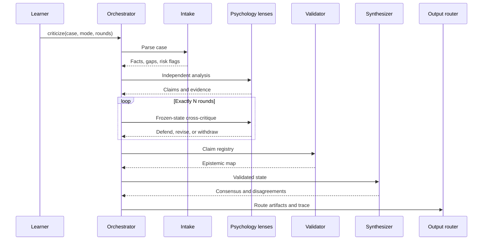

# Psychology Multi-Agent Debate Laboratory

An educational multi-agent laboratory for comparing how psychological theories analyze the same fictional or anonymized case. It makes claims, evidence, challenges, revisions, and uncertainty traceable instead of producing unrelated essays.

This project is not a clinical diagnosis tool, therapy service, medication guide, or crisis service. It models theoretical lenses inspired by published schools of psychology; it does not reproduce historical people or make judgments on their behalf.

## Workflow



Application state—not model conversation history—controls participants, rounds, claim lifecycle, routing, events, and checkpoints.

## Implemented MVP

- Input support for `.md`, `.txt`, and `.json`.
- Eight configurable lenses: Freud, Jung, Skinner, Rogers, Beck, Bowlby, Frankl, and Ellis inspired.
- Independent analysis before any lens sees another lens's output.
- Deterministic round-robin critique with a frozen snapshot at each round boundary.
- Claim Registry with `active`, `challenged`, `revised`, `withdrawn`, `disputed`, and `converged` states.
- Revision decisions: `DEFEND`, `REVISE`, `PARTIALLY_REVISE`, and `WITHDRAW_CLAIM`.
- Epistemic labels: `FACT`, `INTERPRETATION`, `ASSUMPTION`, `HYPOTHESIS`, and `RECOMMENDATION`.
- Code- and prompt-level educational safety boundaries.
- Distinct `analyse`, `consulting`, and `both` routes.
- Markdown debate log, JSON trace, events, and stage checkpoints.
- OpenAI Responses API adapter and a deterministic mock provider.

## Structure

```text
app/                 Python application
  agents/            Intake, psychology, validator, synthesizer
  orchestration/     Runner, debate engine, claim registry, routing
  outputs/           Markdown, JSON, filenames
  providers/         Provider protocol, OpenAI adapter, mock provider
  utils/             Prompt loading, slugging, local time
config/              Runtime and psychology-panel configuration
prompts/             Shared, system, lens, and debate prompts
input/               Learner case files
analyse/             Theoretical analysis artifacts
consulting/          Educational consultation artifacts
logs/                Debate Markdown and JSON traces
checkpoints/          Serializable stage and round state
examples/            Fictional example cases
tests/               Executable product contract
```

## Install

Python 3.11 or newer is required.

```bash
python -m venv .venv
source .venv/bin/activate
python -m pip install -e '.[dev]'
```

On Windows PowerShell:

```powershell
.venv\Scripts\Activate.ps1
```

## OpenAI setup

Set your key locally:

```bash
export OPENAI_API_KEY="your-key"
```

The application reads `OPENAI_API_KEY` from the environment and never stores it in logs. Choose a model available to your account in `config/settings.yaml`. The adapter uses the official [OpenAI Responses API](https://developers.openai.com/api/docs/guides/structured-outputs).

For a credential-free demonstration, use `--provider mock`.

## Add and run a case

```bash
cp examples/case-work-withdrawal.md input/
python -m app criticize \
  --case case-work-withdrawal.md \
  --mode both \
  --rounds 3
```

Offline demonstration:

```bash
python -m app criticize \
  --case case-work-withdrawal.md \
  --mode both \
  --rounds 3 \
  --provider mock
```

If `--rounds` is omitted, `debate.rounds` from `config/settings.yaml` is used. The CLI value takes precedence.

JSON input accepts this minimum shape:

```json
{
  "title": "Fictional case title",
  "narrative": "An anonymized or fictional case narrative.",
  "questions": ["What evidence would distinguish the hypotheses?"]
}
```

Case files must be directly inside `input/`; path traversal and unsupported extensions are rejected.

## Output modes and logs

- `analyse`: theoretical comparison, competing hypotheses, claim evolution, and epistemic map in `analyse/`.
- `consulting`: questions, evidence gaps, blind spots, and learning exercises in `consulting/`.
- `both`: generates both distinct documents.

Each run can also write:

- `logs/criticize-log-<local timestamp>-<case>.md`
- `logs/criticize-log-<local timestamp>-<case>.json`
- `checkpoints/<run-id>-<stage>.json`

The trace shows who made each claim, linked evidence, challenges, revision history, final status, validation, and run events. Independent analyses are frozen before debate. In round N, a lens can only see state completed before that round.

## Configure or add lenses

Disable a lens in `config/agents.yaml`:

```yaml
agents:
  jung:
    enabled: false
    display_name: Jung-inspired analytical psychology lens
    prompt_path: psychology/jung.md
```

Each configured lens has its own prompt contract under `prompts/psychology/`. The contract defines its theoretical focus, evidence priorities, required epistemic/safety boundaries, and characteristic blind spot. At startup, the factory validates every enabled lens's prompt before the run begins.

At least two lenses must remain enabled. `prompt_path` must stay under `prompts/psychology/`. To add a lens:

1. Add an entry to `config/agents.yaml`.
2. Add `prompts/psychology/<key>.md` with its focus, evidence preferences, limitations, and safety constraints.
3. Add tests for its output contract and limitations.
4. Add its focus to the mock provider if it must run in offline demonstrations.

The registry/factory discovers configured lenses without changing the orchestration loop.

## Tests

```bash
python -m pytest
```

Tests cover configuration, input safety, exact rounds, CLI override, disabled agents, routing modes, filenames, missing data, unsupported diagnosis, claim revision, no hidden-reasoning field, and a complete mocked run without an API key.

## Failure behavior

Provider calls retry according to `runtime.retries`. If one lens fails, execution continues when at least two participants remain and the missing output is disclosed to synthesis. A provider-wide failure writes a `failed` checkpoint and exits non-zero.

The MVP saves serializable state, but a `resume` CLI command is not implemented yet. Checkpoints currently support inspection and future resume work.

## Known limitations

- Live OpenAI output is requested as JSON and parsed at the provider boundary; schema-constrained typed responses can further strengthen reliability.
- Round-robin critiques one current claim per target lens per round.
- Claim convergence exists in the state model but is not automatically inferred.
- The mock provider proves workflow behavior, not real analysis quality.
- Crisis keywords are conservative and do not replace professional safety assessment.
